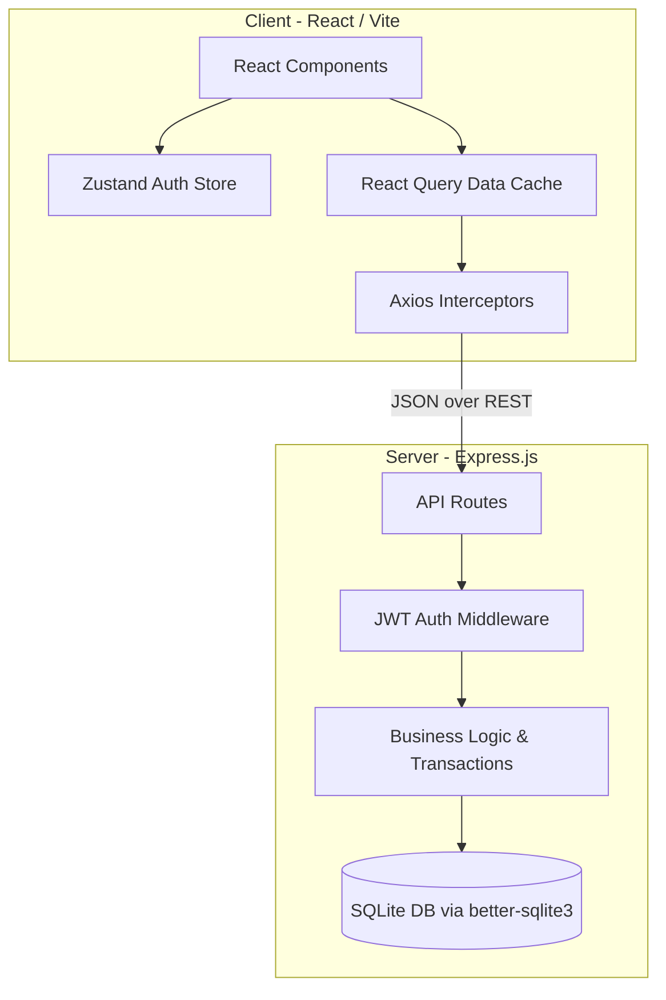
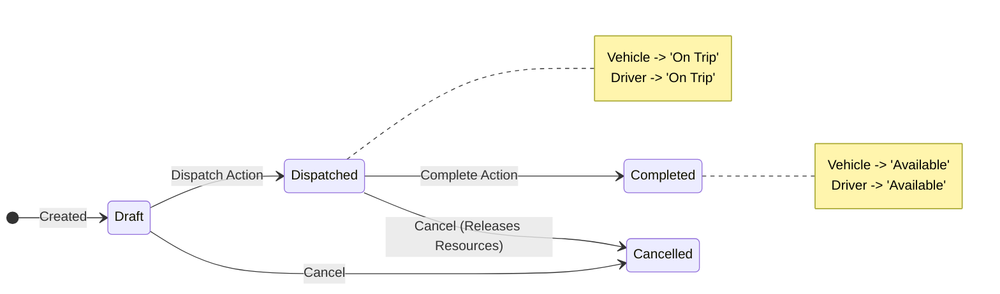

# VRITTI ⚡ 
**Flow State Transport Operations Platform**

VRITTI is an end-to-end transport operations platform that digitizes vehicle, driver, dispatch, maintenance, and expense management while enforcing strict business rules and providing real-time operational insights.

---

## 🏛 System Architecture

The application follows a decoupled client-server monorepo architecture:



### Business Logic: Trip State Machine
Trips enforce atomic state transitions on the assigned Vehicles and Drivers, locking them from double-dispatch:



---

## 🚀 In-Depth Platform Features

### 🚛 1. Fleet Registry & Vehicle Management
- **Complete Vehicle Profiles**: Track essential metrics like max load capacity, acquisition costs, current odometer readings, and regional assignments.
- **Real-Time Status Tracking**: Vehicles transition automatically between `Available`, `On Trip`, `In Shop`, and `Retired`.
- **Intelligent Validations**: Prevents dispatching vehicles that are overloaded (cargo exceeds max load), currently on a trip, or in maintenance.

### 🧑‍✈️ 2. Driver Management & Safety
- **License Expiry Monitoring**: Smart alerts and visual badges for licenses expiring within 30 days. Automatically prevents dispatching drivers with expired licenses.
- **Safety Scores**: Gamified safety tracking. Safety Officers can manually adjust scores based on driving behavior, directly affecting dispatch prioritization.
- **Disciplinary Actions**: Suspend or reinstate drivers with a single click, instantly blocking them from new trip assignments.

### 🛣️ 3. Dispatch & Trip Operations
- **End-to-End Workflow**: Move trips from `Draft` to `Dispatched` to `Completed` with seamless UI interactions.
- **Atomic Locking**: Dispatching a trip locks the vehicle and driver. They cannot be assigned to another trip until the current one is completed.
- **Automated Logging**: Completing a trip requires logging the end odometer reading and fuel consumption, instantly calculating revenue and expenses.

### 🔧 4. Maintenance & Servicing
- **Active Maintenance Locks**: Opening a maintenance record instantly marks a vehicle as `In Shop`, hiding it from the dispatch board.
- **Lifecycle Tracking**: Log repair costs, mechanics, descriptions, and duration.
- **Auto-Release**: Closing a maintenance ticket immediately returns the vehicle to `Available` status.

### ⛽ 5. Fuel & Expense Tracking
- **Granular Fuel Logs**: Record liters, cost per liter, and filling station data. Ties directly into the vehicle's overall operational costs.
- **Miscellaneous Expenses**: Log tolls, driver stipends, fines, and other operational expenses categorised by vehicle.
- **Summary Dashboards**: View side-by-side totals for fuel costs vs. other expenses to spot cash-flow leaks.

### 📊 6. Analytics & ROI Reporting
- **Fuel Efficiency Trends**: Bar charts identifying the most and least fuel-efficient vehicles (km/L).
- **Cost Breakdown**: Stacked charts showing Fuel vs. Maintenance costs per vehicle.
- **Fleet Utilization**: Line graphs showing active trips and vehicles used over time.
- **Automated ROI Calculations**: Real-time calculation of a vehicle's Return on Investment (Revenue - Operational Costs / Acquisition Cost).
- **CSV Exports**: One-click download of Analytics data for Excel/financial modeling.

### 🛡️ 7. Role-Based Access Control (RBAC)
VRITTI is built with enterprise-grade modular permissions:
- **Fleet Manager**: Full god-mode access (CRUD on everything, retire vehicles).
- **Dispatcher**: Can manage trips and view drivers/vehicles, but cannot edit safety scores or see maintenance costs.
- **Safety Officer**: Focused on driver safety, license expiries, and suspensions. Cannot dispatch trips.
- **Financial Analyst**: Access strictly limited to Fuel/Expenses, Analytics, and financial exports.

---

## 🛠 Getting Started

### 1. Installation
Clone the repository and install all dependencies:
```bash
git clone https://github.com/ascend-x/vritti.git
cd vritti
npm install
cd client && npm install
cd ../server && npm install
cd ..
```

### 2. Database Initialization
Seed the SQLite database with generated demo data:
```bash
cd server
npm run seed
cd ..
```

### 3. Running the Platform
Start both the backend API and the frontend concurrently:
```bash
npm run dev
```

- **Frontend**: [http://localhost:5173](http://localhost:5173)
- **Backend API**: [http://localhost:5000/api](http://localhost:5000/api)

---

## 🔑 Demo Credentials
The platform is seeded with 4 default users demonstrating the RBAC features:

| Role | Email | Password |
|------|-------|----------|
| Fleet Manager | `admin@vritti.com` | `password123` |
| Dispatcher | `dispatch@vritti.com` | `password123` |
| Safety Officer | `safety@vritti.com` | `password123` |
| Financial Analyst | `finance@vritti.com` | `password123` |
