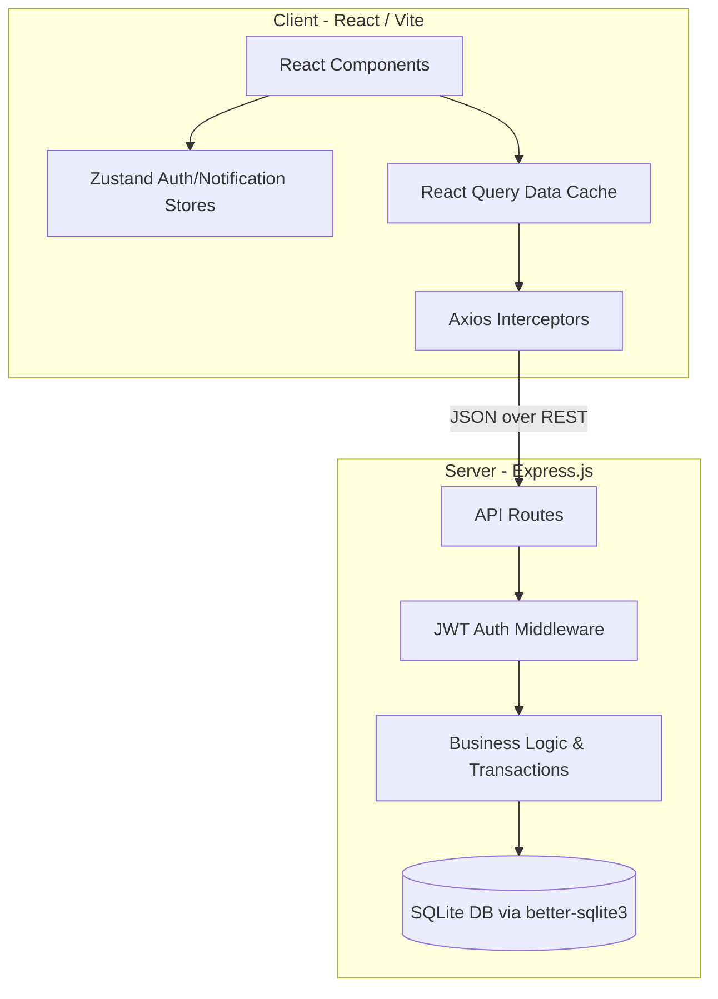
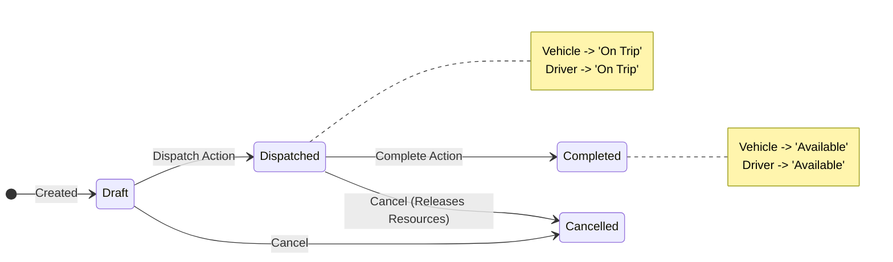

# VRITTI ⚡ 
**Flow State Transport Operations Platform**

VRITTI is an end-to-end transport operations platform that digitizes vehicle, driver, dispatch, maintenance, and expense management while enforcing strict business rules and providing real-time operational insights.

---

## 🏛 System Architecture

The application follows a decoupled client-server monorepo architecture:



### Business Logic: Trip State Machine
Trips enforce atomic state transitions on the assigned Vehicles and Drivers, locking them from double-dispatch:



---

## 🚀 In-Depth Platform Features

### 🧠 1. AI Assistant & Command Palette
- **AI Chatbot**: Context-aware AI assistant to answer questions about operations, rules, and fleet management.
- **Global Command Palette**: Hit `Cmd+K` / `Ctrl+K` to quickly navigate anywhere in the platform, dispatch trips, or look up drivers instantly.

### 🗺️ 2. Route Optimization & Tracking
- **Smart Routing**: Integrates with OSRM (Open Source Routing Machine) to visualize and optimize travel paths between origin and destination.
- **Live Trip Board**: A drag-and-drop Kanban board for managing trips dynamically across states (Draft -> Dispatched -> Completed).

### 🚛 3. Fleet Registry & Vehicle Management
- **Complete Vehicle Profiles**: Track essential metrics like max load capacity, acquisition costs, current odometer readings, and regional assignments.
- **Intelligent Validations**: Prevents dispatching vehicles that are overloaded (cargo exceeds max load), currently on a trip, or in maintenance.

### 🧑‍✈️ 4. Driver Management & Leaderboard
- **Driver Leaderboard**: Gamified system ranking drivers by safety scores, completed trips, and revenue generated.
- **License Expiry Monitoring**: Smart alerts and visual badges for licenses expiring within 30 days. Automatically prevents dispatching drivers with expired licenses.
- **Safety Scores**: Gamified safety tracking. Safety Officers can manually adjust scores based on driving behavior, directly affecting dispatch prioritization.

### 🔔 5. Real-Time Operations & Auditing
- **Notification Center**: Socket.io powered real-time alerts pushed to all dispatchers when trip states change.
- **Global Audit Log**: Tracks exactly *who* did *what* and *when* across the entire application to ensure absolute accountability.
- **Carbon Footprint Calculator**: Tracks and reports on fleet-wide CO2 emissions based on fuel consumption and distance traveled.

### 🔧 6. Maintenance & Servicing
- **Active Maintenance Locks**: Opening a maintenance record instantly marks a vehicle as `In Shop`, hiding it from the dispatch board.
- **Auto-Release**: Closing a maintenance ticket immediately returns the vehicle to `Available` status.

### ⛽ 7. Fuel & Expense Tracking
- **Granular Fuel Logs**: Record liters, cost per liter, and filling station data. Ties directly into the vehicle's overall operational costs.

### 📊 8. Analytics & ROI Reporting
- **Cost Breakdown**: Stacked charts showing Fuel vs. Maintenance costs per vehicle.
- **Automated ROI Calculations**: Real-time calculation of a vehicle's Return on Investment (Revenue - Operational Costs / Acquisition Cost).

### 🛡️ 9. Role-Based Access Control (RBAC)
VRITTI is built with enterprise-grade modular permissions:
- **Fleet Manager**: Full god-mode access (CRUD on everything, retire vehicles).
- **Dispatcher**: Can manage trips and view drivers/vehicles.
- **Safety Officer**: Focused on driver safety, license expiries, and suspensions.
- **Financial Analyst**: Access strictly limited to Fuel/Expenses, Analytics, and financial exports.

---

## 🛠 Getting Started (Production via Docker)

VRITTI is fully containerized for production deployment.

### 1. Installation
Clone the repository:
```bash
git clone https://github.com/ascend-x/vritti.git
cd vritti
```

### 2. Start the Docker Containers
This will build the Vite frontend (served via Nginx) and the Node.js backend.
```bash
docker compose up -d --build
```

### 3. Access the Platform
- **Frontend App**: [http://localhost:8080](http://localhost:8080)
- **Backend API**: [http://localhost:5000/api](http://localhost:5000/api)

> **Note**: Your database is persisted locally in the `./server/data` directory. If you want to seed it with demo data, you can run `npm run seed` inside the `./server` folder locally before starting docker.

---

## 🔑 Demo Credentials
The platform is seeded with 4 default users demonstrating the RBAC features:

| Role | Email | Password |
|------|-------|----------|
| Fleet Manager | `admin@vritti.com` | `password123` |
| Dispatcher | `dispatch@vritti.com` | `password123` |
| Safety Officer | `safety@vritti.com` | `password123` |
| Financial Analyst | `finance@vritti.com` | `password123` |
