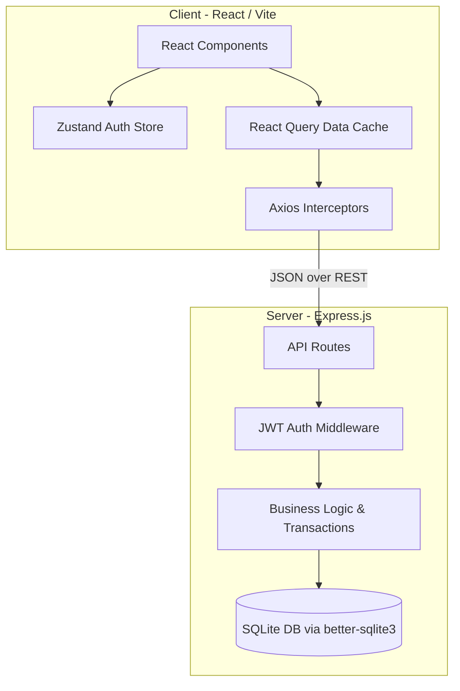
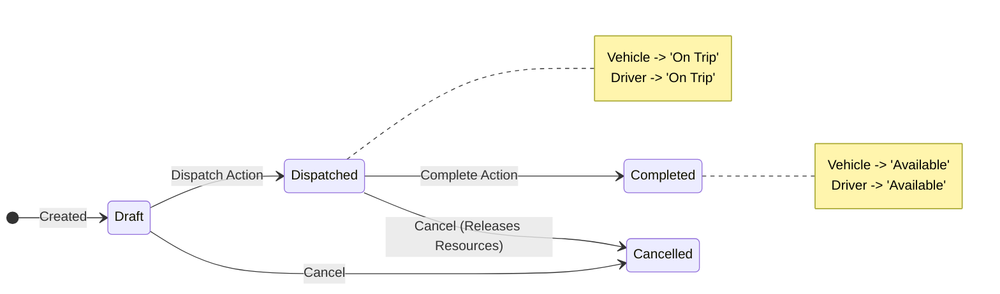

# VRITTI ⚡ 
**Flow State Transport Operations Platform**

VRITTI is an end-to-end transport operations platform that digitizes vehicle, driver, dispatch, maintenance, and expense management while enforcing strict business rules and providing real-time operational insights.

---

## 🏛 System Architecture

The application follows a decoupled client-server monorepo architecture:



### Business Logic: Trip State Machine
Trips enforce atomic state transitions on the assigned Vehicles and Drivers, locking them from double-dispatch:



---

## ✨ Key Features
- **Fleet Registry**: Track vehicle capacities, acquisition costs, and automatic maintenance statuses.
- **Driver Management**: Track safety scores, monitor license expiry (automatic suspension rules).
- **Dispatch & Trip Management**: Complete trip lifecycle tracking with strict business rules (e.g., Cannot dispatch a vehicle that is 'In Shop' or 'Retired').
- **Maintenance Logging**: Open/close maintenance tickets, automatically marking vehicles as 'In Shop'.
- **Analytics Dashboard**: Real-time KPIs, Fuel Efficiency metrics, Monthly Revenue, and Vehicle ROI calculation.
- **Role-Based Access Control (RBAC)**: Distinct permissions for Fleet Managers, Dispatchers, Safety Officers, and Financial Analysts.

---

## 🚀 Getting Started

### 1. Installation
Clone the repository and install all dependencies:
```bash
git clone https://github.com/ascend-x/vritti.git
cd vritti
npm install
cd client && npm install
cd ../server && npm install
cd ..
```

### 2. Database Initialization
Seed the SQLite database with generated demo data:
```bash
cd server
npm run seed
cd ..
```

### 3. Running the Platform
Start both the backend API and the frontend concurrently:
```bash
npm run dev
```

- **Frontend**: [http://localhost:5173](http://localhost:5173)
- **Backend API**: [http://localhost:5000/api](http://localhost:5000/api)

---

## 🔑 Demo Credentials
The platform is seeded with 4 default users demonstrating the RBAC features:

| Role | Email | Password |
|------|-------|----------|
| Fleet Manager | `admin@vritti.com` | `password123` |
| Dispatcher | `dispatch@vritti.com` | `password123` |
| Safety Officer | `safety@vritti.com` | `password123` |
| Financial Analyst | `finance@vritti.com` | `password123` |
